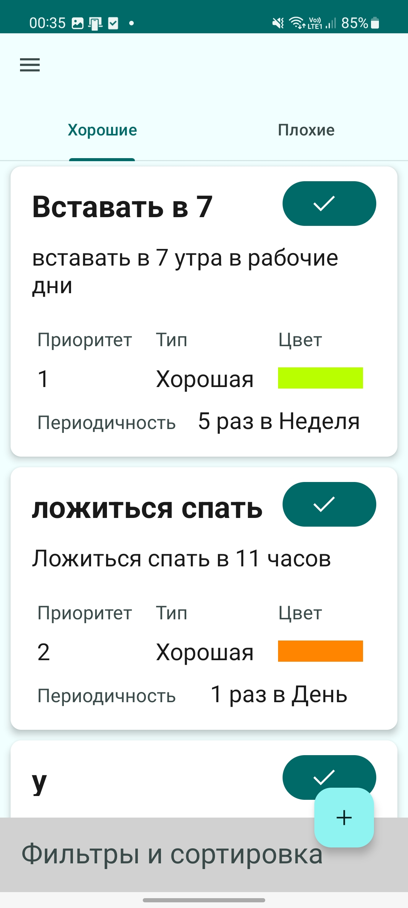

# My Habits

My Habits - простое мобильное приложение для отслеживания привычек.
Сделано в рамках [курса](https://www.youtube.com/playlist?list=PLQ09TvuOLytS_vYHtFHQzZJFcnbYCYF6x) от Doubletapp

## Возможности:
* Разделение привычек на хорошие и плохие
* Приоритезация привычек
* Поиск по названию
* Сортировка по приоритету, количеству выполнений и повторений

## Стек технологий:
* Kotlin
* Clean Architecture
* Coroutines
* Retrofit
* Room
* Dagger
* JUnit
* Mockito
* Kaspresso

Код покрыт Unit и UI тестами

## Скриншоты

